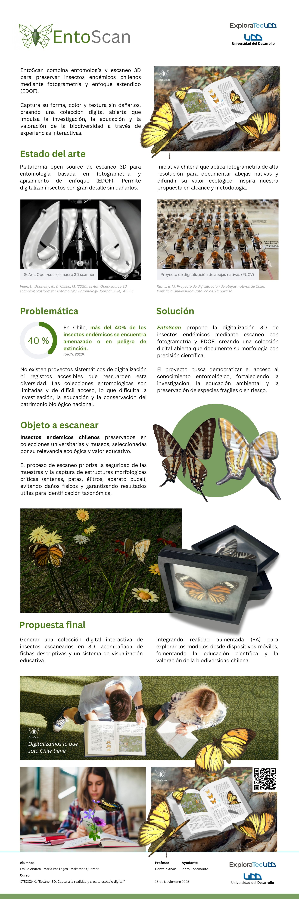
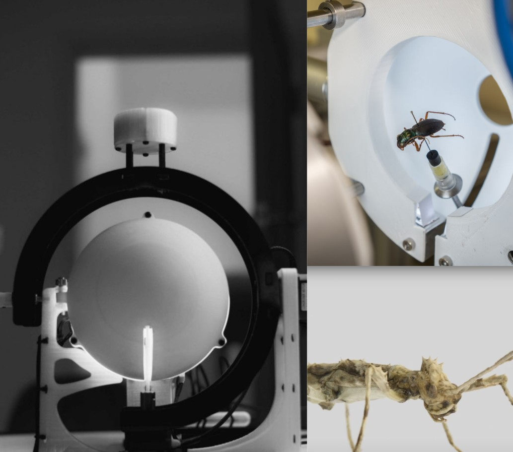
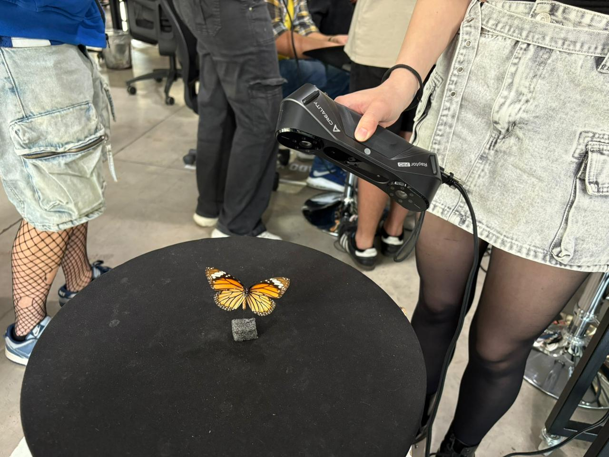
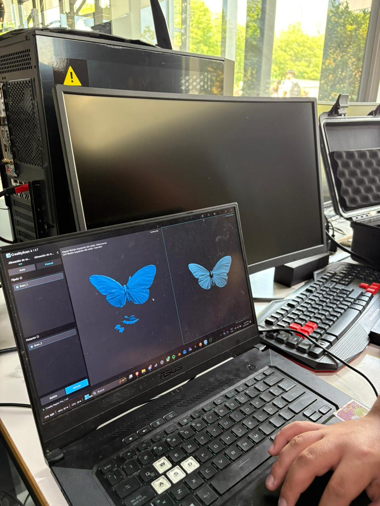
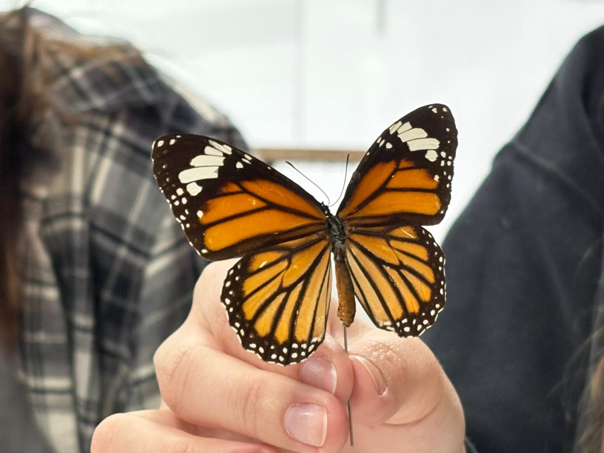
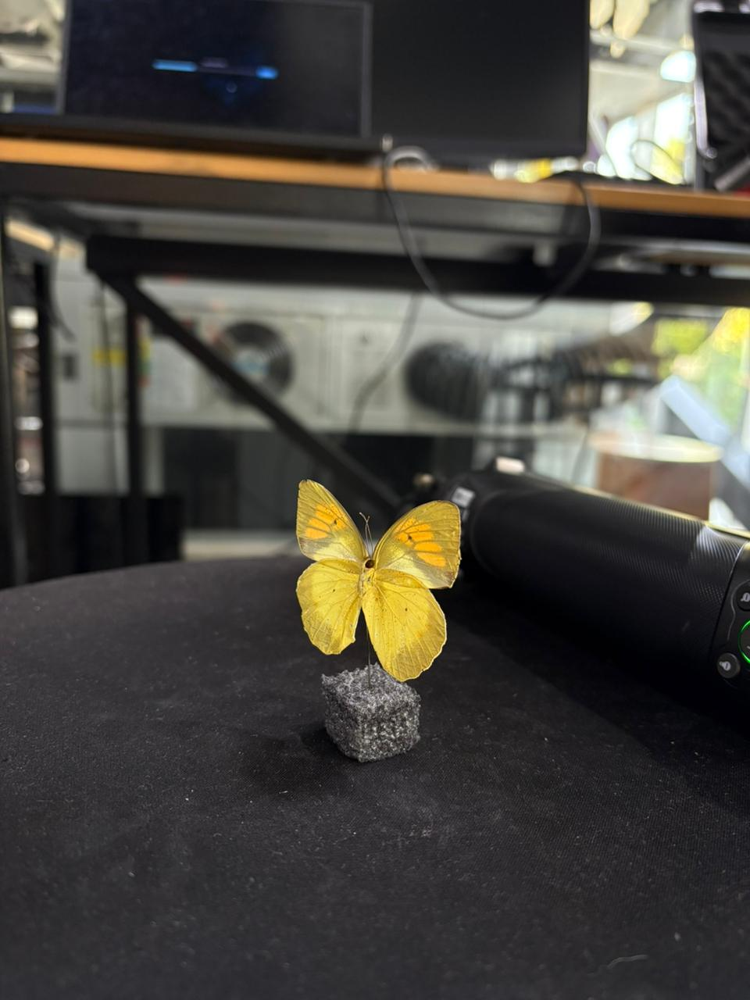

# 🦋 EntoScan  
Digitalización 3D de insectos endémicos mediante fotogrametría y escaneo infrarrojo  
**Proyecto UDD - 2025**

---

## 🖼️ Vista general del proyecto

  

---

## 📘 Sobre el proyecto

**EntoScan** busca preservar insectos endémicos chilenos mediante **escaneo 3D**, **fotogrametría** y **EDOF**, generando una colección digital accesible para investigación, educación y divulgación científica.

En Chile, más del **40%** de los insectos endémicos está amenazado o en peligro de extinción. La digitalización 3D permite conservar estas especies frágiles sin dañarlas.

---

## 🎯 Objetivos

- Digitalizar insectos endémicos con escaneo 3D de alta fidelidad.  
- Preservar estructuras anatómicas importantes.  
- Crear una colección digital abierta y educativa.  
- Proyectar visualización educativa mediante **realidad aumentada (AR)**.

---

## 📚 Estado del arte

  

Referentes utilizados:
- **scAnt** – Plataforma open-source de escaneo macro.  
- **Insect Brain Database** – Modelos neuronales 3D.  
- **Digitalización de abejas nativas (PUCV)** – Fotogrametría avanzada.  
- **Pokédex** – Organización visual + ficha técnica.

---

## 🔍 Metodología

### 1. **Escaneo con Creality Raptor X**

  
  

  
  

---

### 2. **Postprocesado**

- Limpieza de malla  
- Fusión de escaneos  
- Texturizado UV  
- Exportación en `.obj` / `.stl`

  

---

## 🦾 Resultados

  

- Modelos anatómicos detallados  
- Texturas fieles al espécimen  
- Preparados para experiencias de AR  

---

## 📱 Realidad aumentada (AR)

  

El proyecto considera:

- Visualización WebAR  
- Modelos optimizados  
- Fichas educativas extendidas  

---

## 👥 Equipo

**Emilio Abarca**  
**María Paz Lagos**  
**Makarena Quezada**

**Profesor:** Gonzalo Anais  
**Ayudante:** Piero Pedemonte  
**Curso:** XTECC24-1 — *Escáner 3D: Captura la realidad y crea tu espacio digital*  
**Universidad del Desarrollo**

---

## 📚 Referencias (Vancouver)

1. Veen L, Donnelly G, Wilson M. scAnt: Open-source 3D scanning platform for entomology. Entomology Journal. 2020;25(4):43–57.  
2. Weller S. Toward a brighter future for entomological collections. Ann Entomol Soc Am. 2023;116(6):329–330.  
3. Jerez V, Zúñiga-Reinoso Á, Muñoz-Escobar C, Pizarro-Araya J. Acciones y avances sobre la conservación de insectos en Chile. Gayana. 2015;79(1):1–3.  
4. The IUCN Red List of Threatened Species. Disponible en: https://www.iucnredlist.org/es  
5. Ruz L. Proyecto de digitalización de abejas nativas de Chile. Pontificia Universidad Católica de Valparaíso.  
6. Insect Brain Database. Disponible en: https://insectbraindb.org  

---

## 🧾 Licencia

Este repositorio es público y su contenido puede utilizarse con fines académicos, educativos y de investigación.  
**No se permite el uso comercial de los modelos 3D** sin autorización del equipo desarrollador.

---

